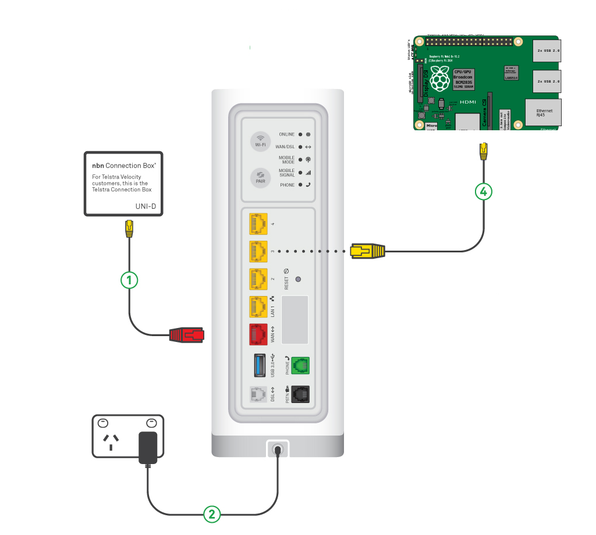

# NBN Monitoring
## Introduction

Application for the monitoring of Internet/WAN connections checking the connection is up and running and the internet can be accessed.

## Solution

The hardware being used for this an old Raspberry Pi I have lying about. Connected directly to the Telstra Smart Modem using Ethernet.



The software side of the application is broken down into three components. The first performs monitoring of the internet connection by performing TCP traceroute and ping tests, and grabs the status from the modem. This monitoring is written to a flat file. The second component reads and parses the monitoring date from the flat file and saves to a MongoDb database. The third component are the screens, a J2EE WAR with a couple of screens accessing the monitoring results from the database.

## Raspberry Pi Configuration

Steps taken to configure the PI server.

#### 1) Updates

Make sure that we are fully up to date.
```Bash
$ sudo apt update
$ sudo apt full-upgrade
$ sudo apt autoremove
$ sudo apt clean
```
  
  
#### 2) Configure hostname  

Configured a known host name for easier access on the private network. Need to add the name to hostname file, plus add a hostename reference in the hosts file;
```Bash  
$ sudo vi /etc/hostname
ws1
$ sudo vi /etc/hosts
127.0.1.1	ws1
```    
    
#### 3) Enable remote connections

Not critical for the application, just makes life easier.

From main menu->Preferences->Raspberry Pi Configuration

In the configuration dialog select then Interfaces tab, then enable both SSH and VNC.

#### 4) Change PI default screen resolution

Advanced Options > Resolution, and choose an option.
'''
hdmi_mode=85
'''

#### 5) Install and Configure Samba

Samba is used for exposing a network drive that is used for transferring files.

Useful doco to read: <https://www.raspberrypi.org/documentation/remote-access/samba.md>

```Bash
$ sudo apt install samba samba-common-bin
$ sudo apt install samba samba-common-bin smbclient cifs-utils
```

First configure the netbios name.

```Bash
$ sudo vi /etc/samba/smb.conf
netbios name = ws1
```

Next add a mount point (at the end of the file) that can be used for uploading and downloading files.

```Bash
$ mkdir -p /home/pi/monitorNbn/share
$ sudo vi /etc/samba/smb.conf
netbios name = ws1
[monitorNbnShare]
   path = /home/pi/monitorNbn/share
   browseable = yes
   guest ok = yes
   guest account = pi
   read only = no
   create mask = 0777
   directory mask = 0777
   public = yes
   writeable = yes
```

Restart the service to pick up the new configuration.

```Bash
sudo systemctl restart smbd
```

#### 6) Downgrade to Java8

The default is Java9 which does not run on on my model of PI, when attempting to run the the
following error message is displayed "Server VM is only supported on ARMv7+ VFP"

```Bash
$ sudo apt-get remove openjdk*
$ sudo apt-get autoremove
$ tar -xvf jdk-8u231-linux-arm32-vfp-hflt.tar.gz
$ sudo update-alternatives --install /usr/bin/java java /home/pi/Apps/java/jdk1.8.0_231/bin/java 1
$ sudo update-alternatives --set java /home/pi/Apps/java/jdk1.8.0_231/bin/java
$ vi ~/.profile
export JAVA_HOME="/home/pi/Apps/java/jdk1.8.0_231"
export PATH="$JAVA_HOME/bin:$PATH"
$ sudo update-alternatives --install /usr/bin/java java /home/pi/Apps/java/jdk1.8.0_231/bin/java 1
$ sudo update-alternatives --set java /home/pi/Apps/java/jdk1.8.0_231/bin/java
```

And test the update is successful.

```Bash
$ java -version
java version "1.8.0_231"
Java(TM) SE Runtime Environment (build 1.8.0_231-b11)
Java HotSpot(TM) Client VM (build 25.231-b11, mixed mode)
```

#### 7) Install MongoDb

```Bash
$ sudo apt-get install mongodb
$ service mongodb status
$ sudo vi /etc/mongodb.conf
Update the bind ip to 0.0.0.0, e.g.
bind_ip = 0.0.0.0
#bind_ip = 127.0.0.1
#port = 27017
$ sudo service mongodb restart
```

#### 8) Install Tomcat

```Bash
$ sudo apt-get install tomcat8
```

Make the webapps directory writeable ready for deployments.

```Bash
$ sudo chmod a+w /var/lib/tomcat8/webapps
```
  
## Configure Development Environment

#### 1) Installs

Install the following;
*Virtual Box
*Vagrant

#### 2) Code

Checkout code from <https://github.com/whamBamDev/monitorNbn.git> to under a local folder, e.g. `D:\Dev\monitorNbn` (the code cloned out to folder `D:\Dev\monitorNbn\monitorNbn`.

#### 3) Vagrant Setup

Install vagrant plugin vbguest

```Bash
$ cd D:\Dev\monitorNbn\monitorNbn\vagrantDevBox
$ vagrant plugin install vagrant-vbguest
```

Under D:\Dev\monitorNbn\monitorNbn\vagrantDevBox copy file localConfig.rb.example to localConfig.rb.
Edit and update the directory parameter to development area.
   HOST_DEV_DIR = 'D:/Dev/monitorNbn'

#### 4)

Create the following folders;
* `D:\Dev\monitorNbn\installDownload`
* `D:\Dev\monitorNbn\share`

#### 5) Java install
Download Oracle JDK version 8u241 (Linux x64 RPM - filebname jdk-8u241-linux-x64.rpm) and put under 
D:\Dev\monitorNbn\installDownload. Unfortunatly it is no longer possible to download Java8 using from within a vagrant script 
(was done using wget).

#### 6) Start VM

Then create and start the VM
```Bash
$ vagrant up
```


#### 7) Build

Build

$ gradle -x test bootRun

$ gradle -x test assemble --continuous

http://localhost:8080


$ gradle cargoStartLocal
$ tail -50f build/output.log

http://localhost:8080/nbnMonitor/

$ gradle cargoRedeployLocal


----


4) Install MongoDb

Useful commands;

> show dbs
> use nbn
> show collections
> db.DailySummary.find()
{ "_id" : ObjectId("5ee4dcb4f95e1856923e805c"), "datafile" : "/home/pi/monitorNbn/share/output/modemStatus_20200401.dat", "date" : ISODate("2020-04-01T00:00:00Z"), "outageCount" : 8, "testCount" : 1438 }
> 

> db.DailySummary.find( { date: { $gt: "2020-06-15" } } ).pretty()
> db.DailySummary.find( { date: { $gt: "2020-06-15" } } ).sort( { date: 1 })
> db.DailySummary.find( { testCount: { $lt: 1000 } } ).sort( { date: 1 })

> db.Outage.find( { startTime: { $gte: "2020-06-15", $lt: "2020-06-16"} } ).sort( { startTime: 1 })

"startTime" : "2020-06-13T08:35:01"


$ ./dataLoader -f /home/pi/monitorNbn/share/output/modemStatus_20200401.dat

//Reload whole 
find  /home/pi/monitorNbn/share/output -not \( -path **/backup/* -prune \) -name "modemStatus_*.dat" -exec ./dataLoader -f  {} \;


Deploy application

$ cp /home/pi/monitorNbn/share/nbnMonitorWar-1.0.war /var/lib/tomcat8/webapps

tail -f /var/log/tomcat8/catalina.out

http://localhost:8080/nbnMonitor
http://localhost:8080/nbnMonitor/api/dailySummary
http://localhost:8080/nbnMonitor/api/outage?date=2020-07-04

http://ws1:8080/nbnMonitorWar-1.0/

7) 

$ cromtab -e

NBN_HOME=/home/pi/monitorNbn/share
NBN_DATA=/home/pi/monitorNbn/share/output
NBN_DATA_LOADER=/home/pi/monitorNbn/share/output

* * * * * flock -w 10 ${NBN_DATA}/modemStatus.lock ${NBN_HOME}/monitorNbnConnection.sh >> ${NBN_DATA}/modemStatus_`date +\%Y\%m\%d`.dat 2>&1

0 6 * * * ${NBN_DATA_LOADER}/bin/dataLoader -f ${NBN_DATA}/modemStatus_`date --date yesterday "+\%Y\%m\%d"`.dat >> ${NBN_DATA_LOADER}/log/dataLoader.log 2>&1


/home/pi/monitorNbn/share/dataLoader/bin/dataLoader -f /home/pi/monitorNbn/share/output/modemStatus_`date --date yesterday "+\%Y\%m\%d"`.dat >> /home/pi/monitorNbn/share/dataLoader/dataLoader.log 2>&1

${NBN_DATA_LOADER}/bin/dataLoader -f ${NBN_DATA}/modemStatus_`date --date yesterday "+\%Y\%m\%d"`.dat >> ${NBN_DATA_LOADER}/log/dataLoader.log 2>&1

dt=$(date --date yesterday "+%a %d/%m/%Y")

$ ./dataLoader -f /home/pi/monitorNbn/share/output/modemStatus_20200401.dat


8) deploy to Tomcat

sudo rm -Rf /var/lib/tomcat8/webapps/ROOT

 cp -v /home/pi/monitorNbn/share/nbnMonitorWar-1.0.war /var/lib/tomcat8/webapps/ROOT.war
  378  tail -f /var/log/tomcat8/catalina.out
  378  tail -f /var/log/tomcat8/catalina.out


Server at localhost:27017 reports wire version 0, but this version of the driver requires at least 2 (MongoDB 2.6).

